#  MP Manager

A free dual pane, Material Design file manager for Android with focus on APKs and the goal to be an open source alternative to MT Manager

  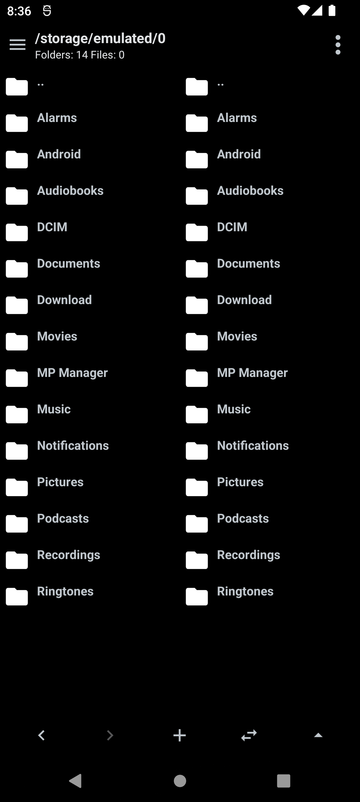 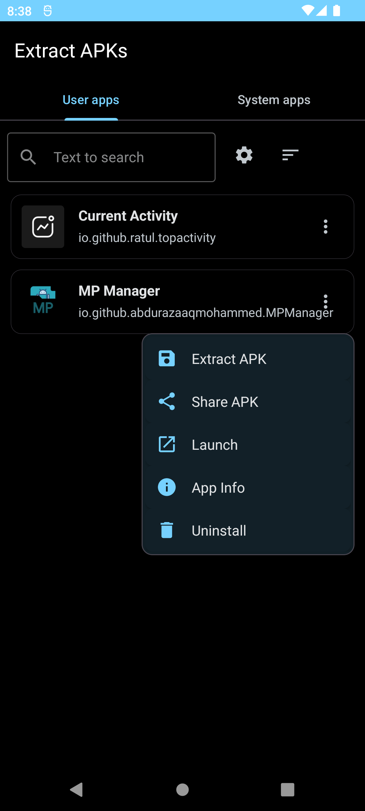

## Features

### File Manager

Dual pane navigation

Browse two folders side by side. This makes it easy to move or copy files from one pane to the other.

A separate home folder can be set for each pane.

There are back and forward buttons, button to sync both panes to the same folder, new file/folder button, parent folder button.

<!-- TODO: Add video

-->

Bookmarks and history

Add any folder to bookmarks and manage them from a bottom drawer. The drawer has tabs for bookmarks and navigation history and opens by swiping up on the bottom bar.

Bookmarks can be deleted by long pressing on one.

  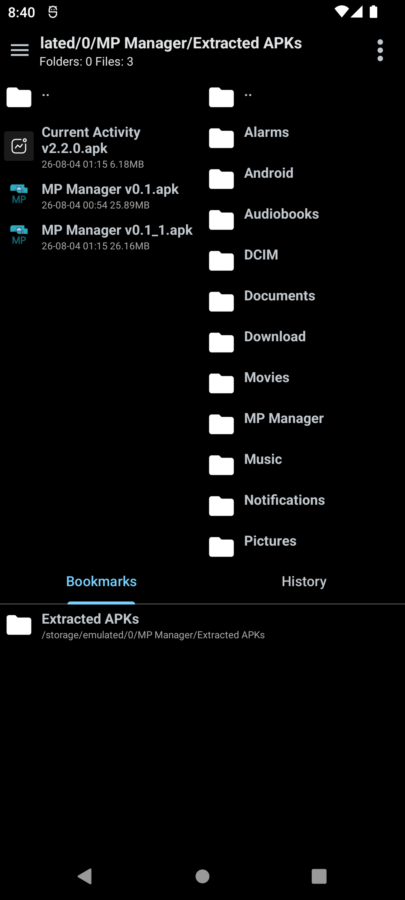
   
  <em>The bookmarks and history drawer</em>

Filtering, sorting and hidden files

Filter the current folder as you type. Sort by name, size, date or type, reverse order, and choose whether a sort applies only to the current folder or everywhere. You can hide files from the list, show or hide system hidden files such as dot folders, and edit the list of manually hidden files later.

  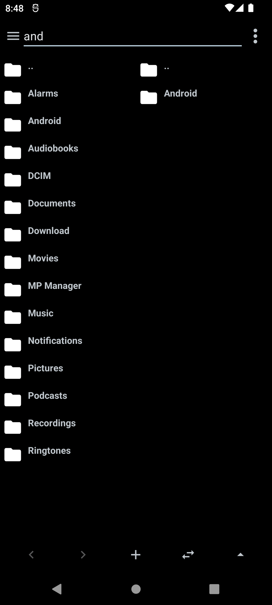 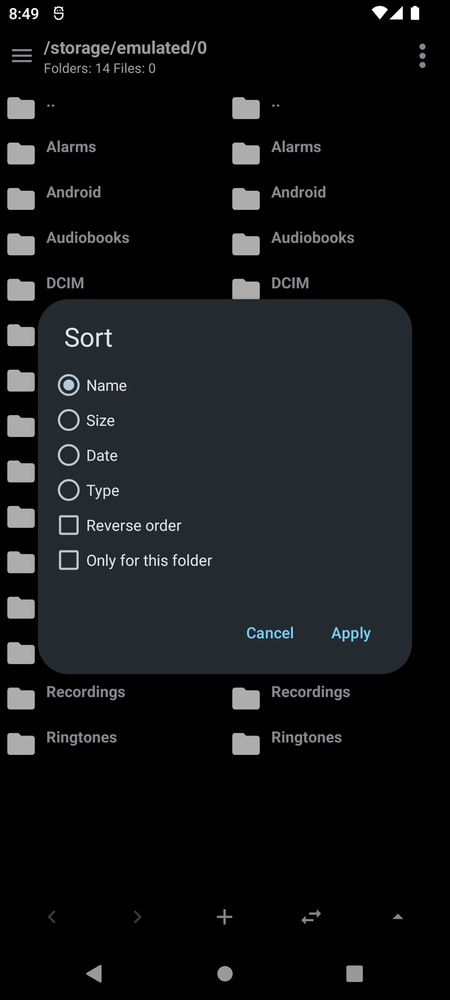 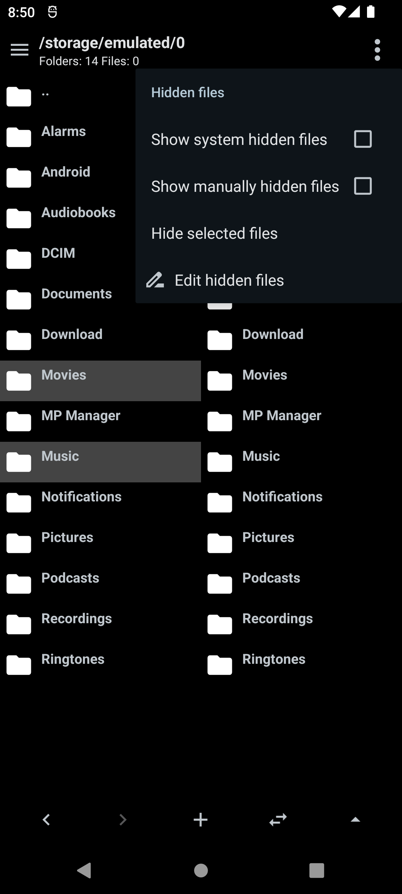
   
  <em>Filter the current folder</em> &nbsp;·&nbsp; <em>Choose a sorting mode</em> &nbsp;·&nbsp; <em>Hide files from the list</em>

Advanced search

Search the current folder by file name and optionally recurse into subfolders. Advanced options include match case, regular expressions, searching for text inside file contents, and minimum or maximum file size. Recent searches are saved for quick reuse.

  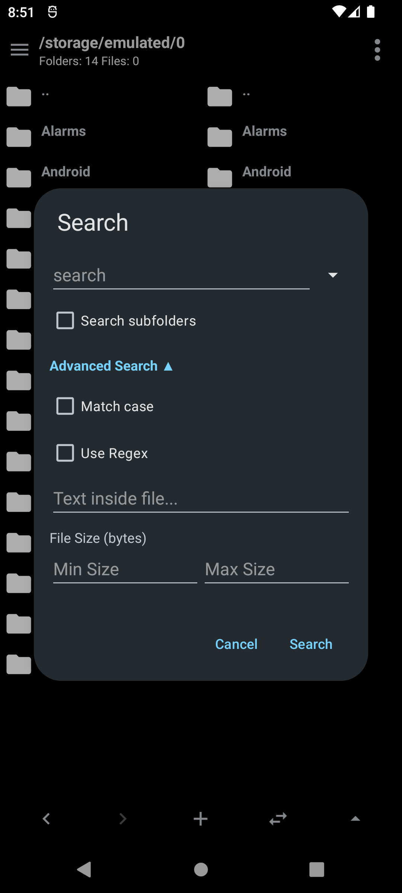
   
  <em>The advanced search dialog</em>

File operations

Create files and folders, rename, copy, move and delete with progress reporting.

Extract, add files in ZIP, APK, auto sign option in APK

Rename several files at once using templates with prefix, suffix, numbering and find/replace.

<!-- TODO: Add screenshots/videos

-->

File properties and sharing

View type, size and last modified date, and copy any value to the clipboard with a long press. Share files or open them with another app.

<!-- TODO: Add screenshots/videos -->

### Media

Built-in audio and video player

Play audio and video files without leaving the app. A mini player dialog with artwork, seek bar and playback controls can play in the background or expand into a full player.

<!-- TODO: Add screenshots/videos

-->

Image viewer

Open images with swipe between pictures in directory. EXIF metadata is shown for supported files, images can be deleted or shared from the viewer.

<!-- TODO: Add screenshots/videos

-->

### APK Tools

APK information and install

Tap an APK to see its icon, name, version code and name, package name, signature schemes used (V1, V2, V3, V4) and whether it is protected. You can view files inside the APK and more features outlined below.

Installing both regular and split APKS is supported.

  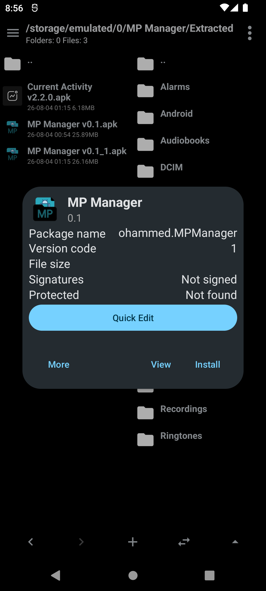
   
  <em>The APK info dialog</em>

Sign APK and split APKs

Sign APKs and split APKs with your own or default (Debug) key. Signing supports JKS and PKCS12 keystores as well as PK8/PEM keys, and new keys can be generated inside the app.

Automatic signing after modifying an APK can be toggled and configured.

Biometrics can be used as alternative to entering password every time.

<!-- TODO: Add screenshots/videos

-->

Decompile, build and protect

All functions from [REAndroid APKEditor](https://github.com/REAndroid/APKEditor) are available: Decompile an APK, Build an APK from a decompiled folder, merge (AntiSplit), Refactor obfuscated resource names and Protect.

  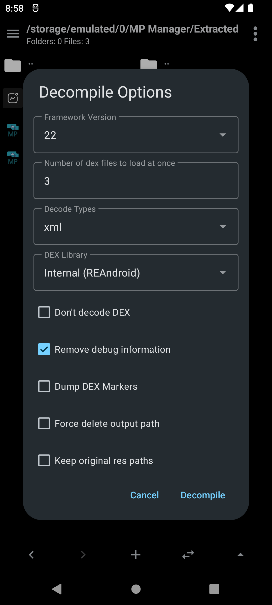
   
  <em>Decompiling</em>

Quick edit APK attributes

Change the launcher icon, app name, install location, version code and name, min SDK and target SDK quickly in a dialog. Every activity and property in the manifest can also be edited from a tree view, including disabling entries.

  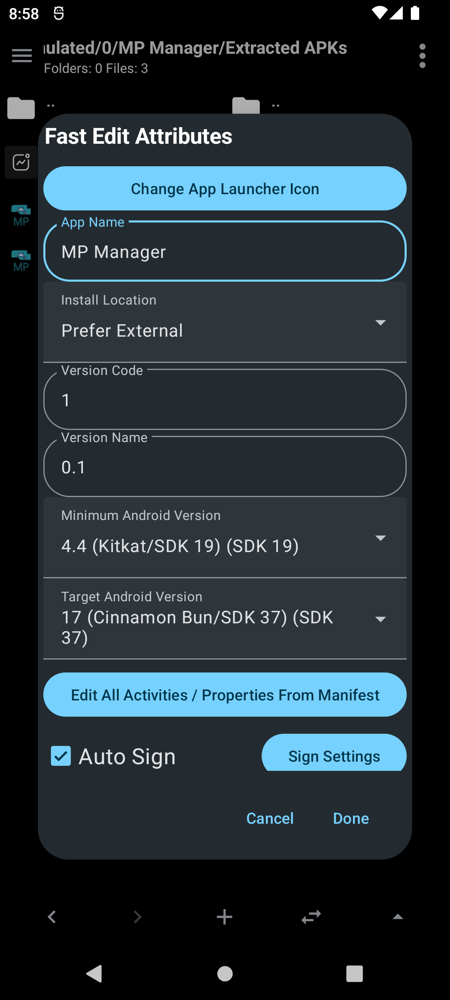
   
  <em>Fast edit attributes</em>

APK optimization and cloning

Optimize APKs by removing chosen files, with a default list of common tracker and metadata files that can be edited. You can [clone an APK](https://github.com/developer-krushna/ApkCloner) with a new package name.

  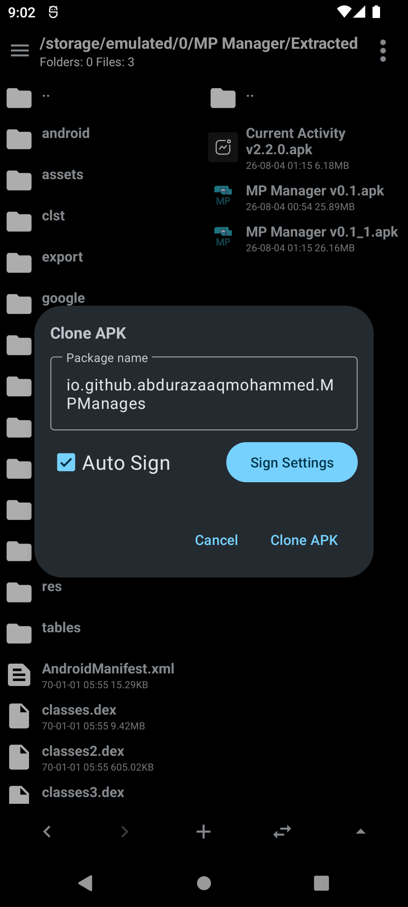
   
  <em>The clone APK dialog</em>

Dex editing

Edit dex files with [DEX Editor Pro](https://github.com/developer-krushna/Dex-Editor-Android) by developer-krushna. When editing a dex file inside an APK you can choose which dex files to load. Saving asks whether to add the modified file back into the APK and sign it, and a .bak backup is created upon modifying an APK.

  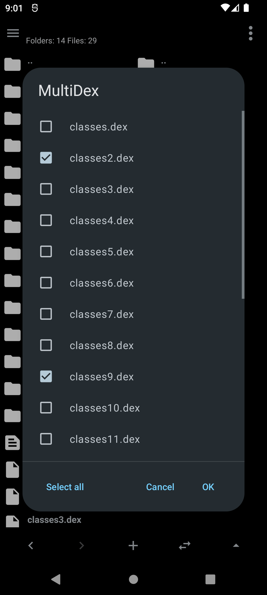 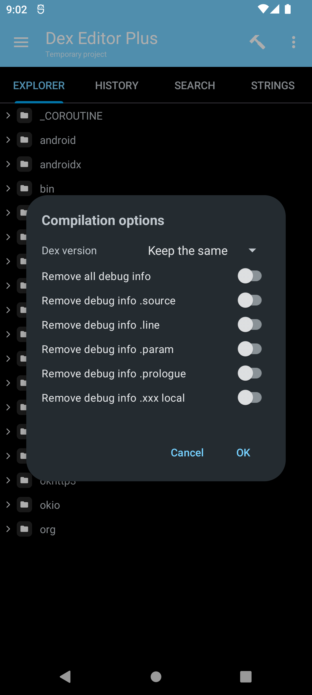
   
  <em>Choose which dex files to load</em> &nbsp;·&nbsp; <em>The integrated dex editor</em>

### Editing and Comparing

Text editor

A full text editor based on [Sora Editor](https://github.com/Rosemoe/sora-editor) with a customizable bottom bar, regex find and replace, and many editor features.

Binary Android XML (AXML) files can be decoded for editing and re-encoded on save automatically.

  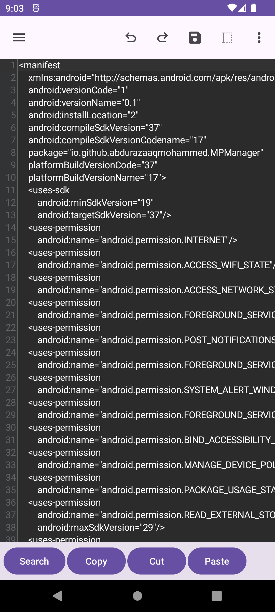
   
  <em>Editing a decoded AXML file</em>

Compare tools

Compare two text files, two ZIP/APK files, or two resources.arsc files. Select one item in each pane and the matching compare option appears in the file menu.

  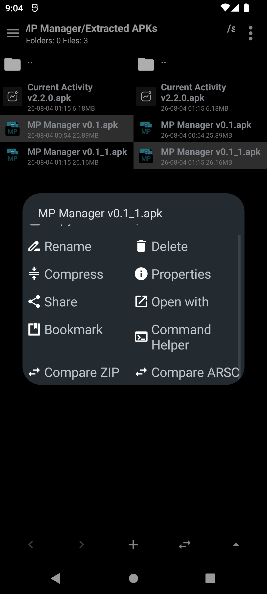 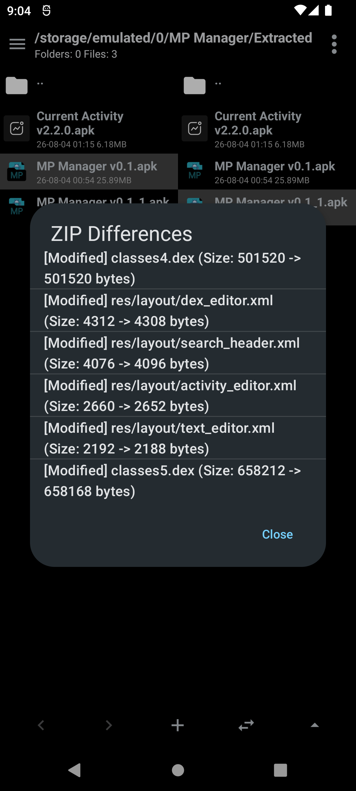
   
  <em>Comparing resources.arsc files</em> &nbsp;·&nbsp; <em>The diff view</em>

### APK Extractor

Extract and share APK parts

Extract APKs in batch and pull out specific parts: the app icon, resources.arsc, classes.dex, AndroidManifest.xml, base.apk, splits and native libs, as well as the launch activity. Split APKs can be merged into a single APK before extracting, and anything can be shared directly.

<!-- TODO: Add screenshots/videos -->

### FTP

FTP server

Use FTP server with custom port, username and password. The server keeps a notification while running so it can be stopped easily. Connection settings can be saved as profiles, and the device IP can be copied or shared.

  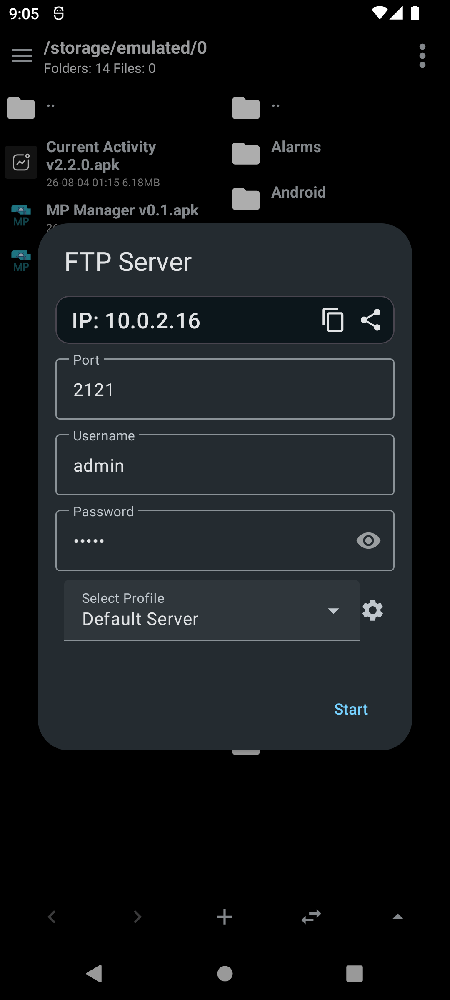
   
  <em>The FTP server dialog</em>

FTP client

Connect to an FTP server and browse remote folders in either pane, with the same navigation controls as local files. Files can be uploaded from the device, and connection details can be saved as profiles (to connect to multiple devices easily).

  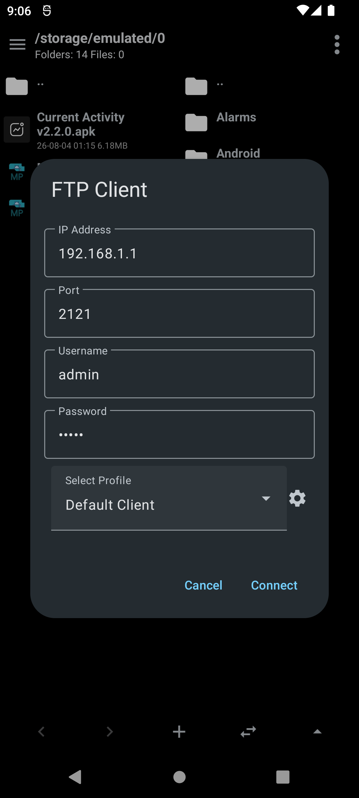
   
  <em>The FTP client dialog</em>

### Utilities

Screen color picker

[Use a floating overlay to find out colors anywhere on the screen.](https://github.com/codehasan/ScreenColorPicker)

  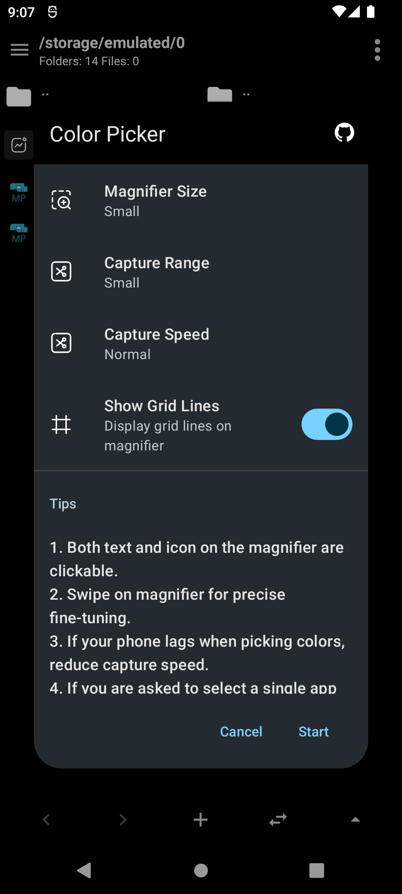 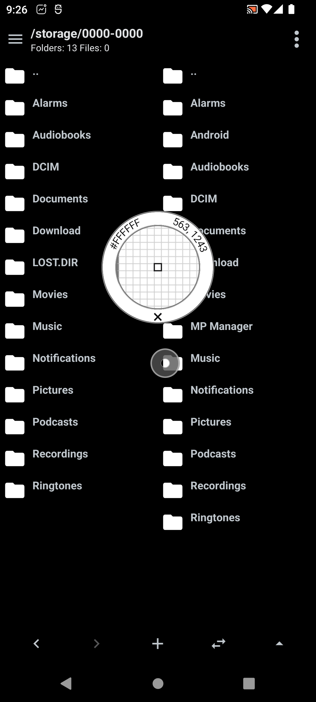
   
  <em>Configuration dialog</em>&nbsp;·&nbsp;
  <em>Picking color</em>

Layout inspector

[Inspect the view hierarchy of any app through a floating overlay window.](https://github.com/AbdurazaaqMohammed/Layout-Inspector)

  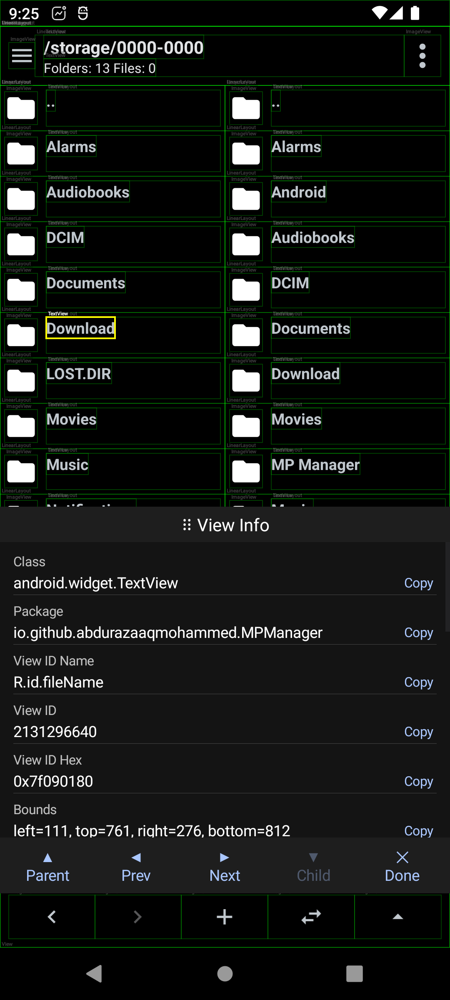
   
  <em>Layout Inspection</em>

Command Helper

Command Helper is a simple but powerful tool. It allows you to create templates for commands that can then be quickly applied to any file you select.

It can generate commands for several files at once, preview them, copy or run them directly in Termux.

* In this way you can quickly run command line tools like dex2c etc. on files via MP Manager

  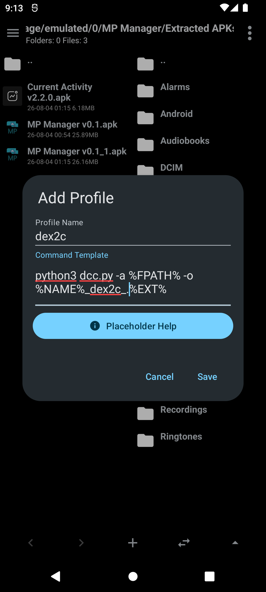 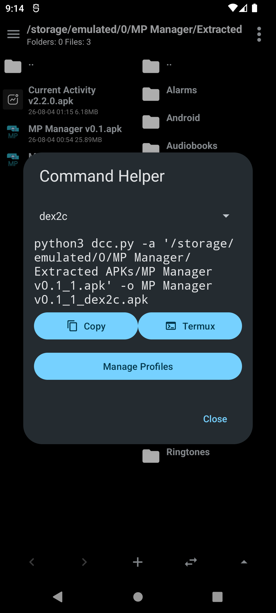
   
  <em>Creating a command profile</em> &nbsp;·&nbsp; <em>The generated command</em>

Appearance and storage info

Choose between system, light, dark and black theme all with Material theme and Dynamic Colors. The sidebar shows mounted storages with used and free space available.

  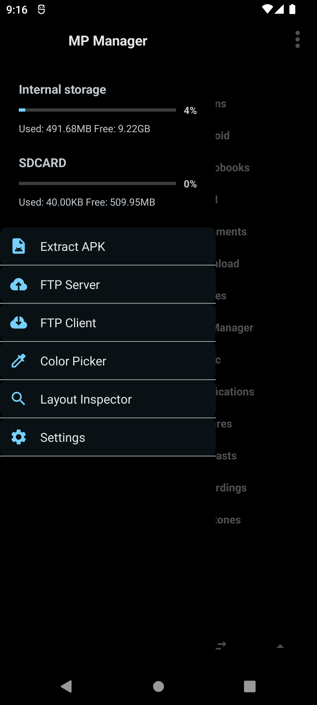
   
  <em>The sidebar with storage usage</em>

# Todo

This app still has lots of work to do and probably many bugs to fix but you can try it

* Add patcher to support multiple patch formats like APK Editor and Lucky Patcher
* Add root and Shizuku file management
* Add improvements to APK optimization
