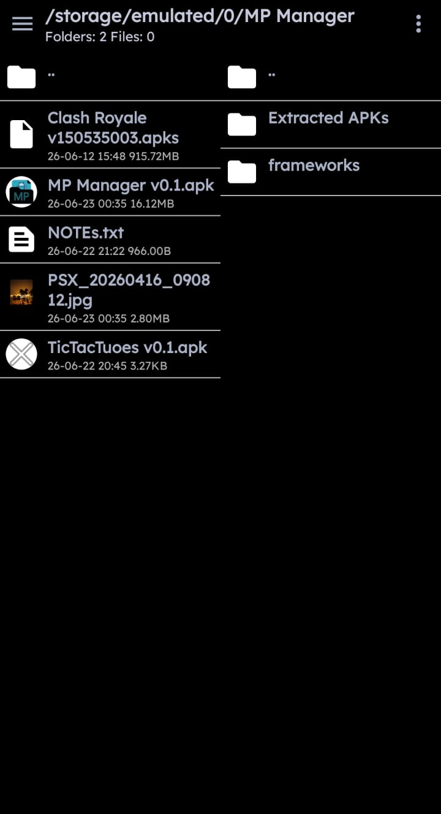
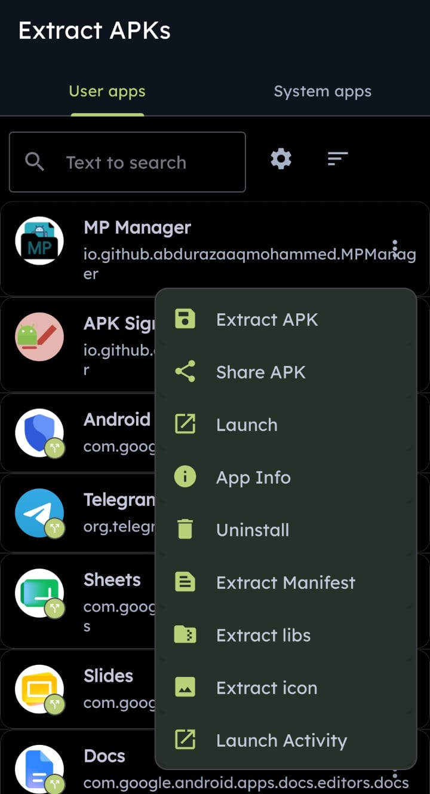
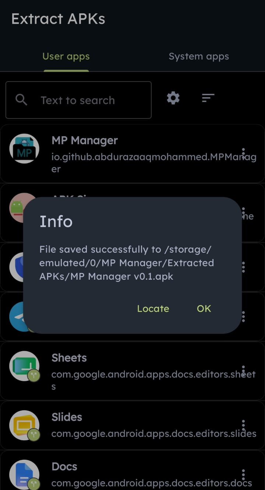

#  MP Manager

A free dual pane, Material Design file manager for Android with focus on APKs and the goal to be an open source alternative to MT Manager

  

## Features
* 

All functions from <a href="https://github.com/REAndroid/APKEditor"> REAndroid APKEditor</a> (Decompile, Build, Merge, Refactor, Protect)

* Sign APK and split APKs
* Quick edit APK attributes icon, name, install location, version code/name, minSdk, targetSdk, Edit all activities/properties in manifest
* AndroidManifest.xml and other AXML decompiling and re encoding built in
* Text compare
* ZIP/APK Compare
* Text editor based on [Sora Editor](https://github.com/Rosemoe/sora-editor) with bottom bar customizable functions like MT with regex replace etc and many features
* Bookmarks, Hidden files, Filter, search in files and file contents with regex
* APK Extractor support batch extraction and functions like AntiSplit/merge and extract, share, extract icon, resources.arsc, classes.dex, AndroidManifest.xml, base.apk, splits, libs, Launch activity

# Todo
This app still has lots of work to do and probably many bugs to fix but you can try it

* Fix when decode AXML with resources.arsc to get full resource references re encoding is breaking
* figure out how to get JKS signature working and create signature in app function
* Create backup .bak file on modifying
* Add patcher to support multiple patch formats like APK Editor and Lucky Patcher
* add root and Shizuku file management
* Add APK optimize etc