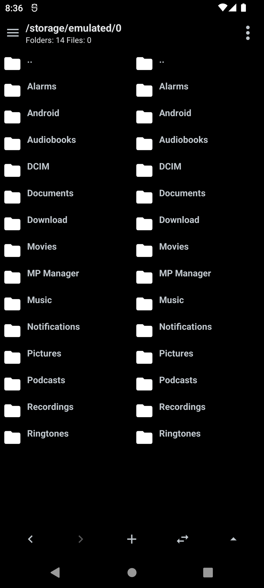
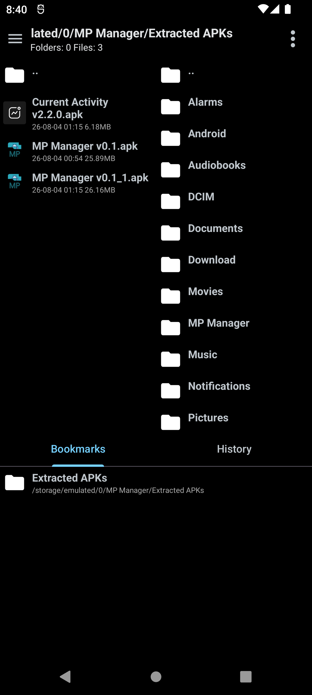
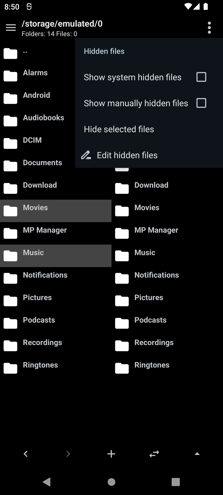
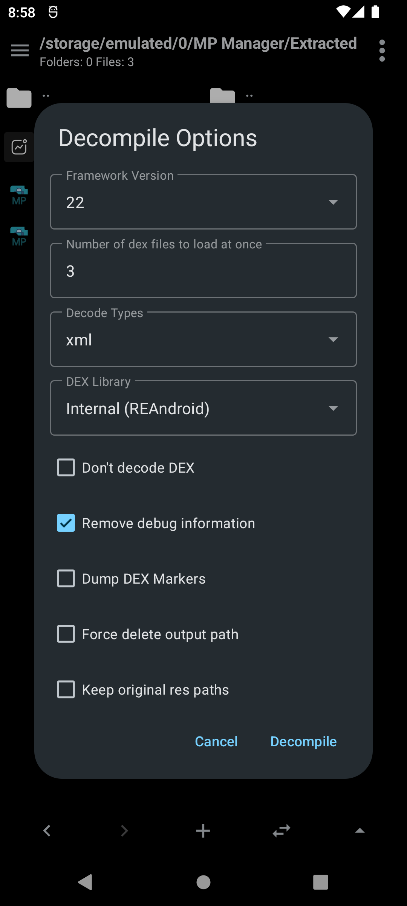
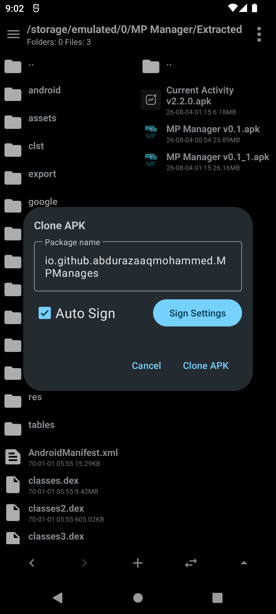
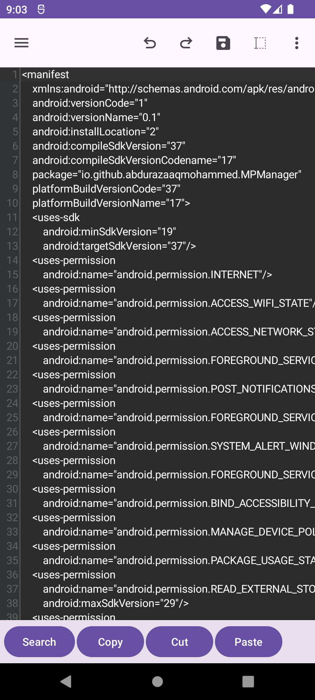
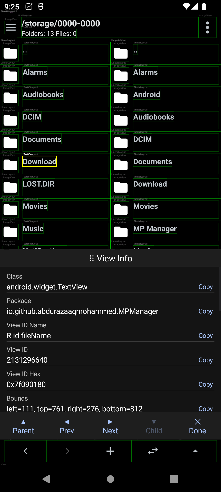
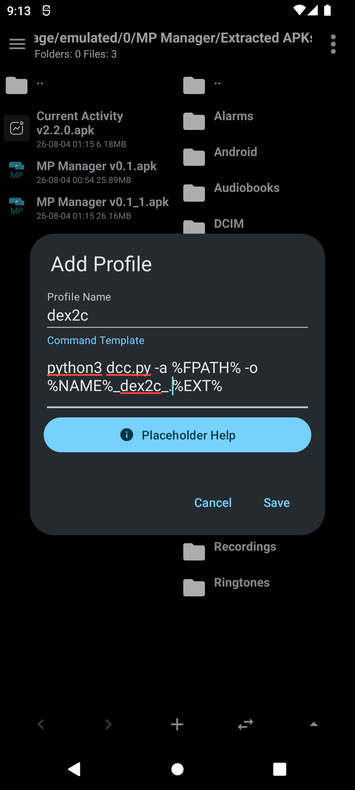

#  MP Manager

一款免费的双栏 Material Design 安卓文件管理器，专注 APK 操作，目标是成为 MT Manager 的开源替代品

界面语言：简体中文、英文、俄语

   

## 功能

### 文件管理

双栏浏览

左右并排浏览两个文件夹，移动或复制文件只需在两栏之间操作。

每个栏位都可以单独设置默认主目录。

提供后退、前进按钮，一键让两栏同步到同一文件夹，新建文件/文件夹按钮，以及返回上级目录按钮。

<!-- TODO: 添加视频

-->

书签与历史记录

把任意文件夹加入书签，并从底部抽屉统一管理。抽屉包含书签与访问历史两个标签页，从底部栏向上滑出即可打开。

长按书签可以删除。

  
   
  <em>书签与历史记录抽屉</em>

过滤、排序与隐藏文件

输入内容即可过滤当前文件夹。可按名称、大小、日期或类型排序，可反转顺序，并可选择排序只对当前文件夹生效还是全局生效。可以隐藏文件列表中的条目、显示或隐藏以点开头的系统隐藏目录，并可随时编辑手动隐藏的列表。

    
   
  <em>过滤当前文件夹</em> &nbsp;·&nbsp; <em>选择排序方式</em> &nbsp;·&nbsp; <em>在列表中隐藏文件</em>

高级搜索

按文件名搜索当前文件夹，可选择递归进入子目录。高级选项包括区分大小写、正则表达式、搜索文件内容中的文本，以及最小或最大文件大小。最近的搜索记录会保存下来便于复用。

  
   
  <em>高级搜索对话框</em>

文件操作

新建文件与文件夹，重命名、复制、移动、删除，均带进度显示。

解压、向 ZIP/APK 内添加文件、APK 自动签名选项。

支持批量重命名，可用模板添加前缀、后缀、编号以及查找替换。

Root 与 Shizuku 模式：包括压缩包内部在内的所有文件操作都可以通过这两种方式执行。在 Shizuku 模式下，即使设备策略禁止读取文件系统根目录，也可以借助 Shizuku 浏览它。

<!-- TODO: 添加截图/视频

-->

压缩包

支持读取与创建 zip、7z、rar、tar 相关格式（包括 `.tar.gz`、`.tar.bz2`、`.tar.xz`，以及单文件的 gzip、bzip2、xz 流），读取加密压缩包同样受支持。

压缩包会直接在栏位中打开，而不只是弹出一个对话框：7z、rar、tar 的列表与 zip 一样在后台加载；遇到加密压缩包，就在此处询问密码。

解压会显示**逐条目的进度，并提供可用的取消按钮**——取消会停止当前条目、删除它写到一半的文件，并保留已经写完的内容。选中多个压缩包后执行解压，会在同一个对话框中依次完成。

在压缩包内部，长按菜单直接作用于条目：提取单个条目或整个选中集合（解压到压缩包同级目录，或解压到正在显示文件夹的对面栏位）、把选中条目压缩成新压缩包、重命名、删除、分享、用其他应用打开、计算校验和。编辑条目并保存会写回压缩包内部；只有支持写入的格式才能写回，遇到不支持的格式应用会提前拒绝，而不是悄悄丢弃修改。

创建压缩包时可选择压缩等级（zip 映射到 deflater 等级，7z 映射到 LZMA2 字典大小，“仅存储”会直接写入不压缩）；zip 还额外支持分卷（拆成
`name.zip.001`、`name.zip.002` …）。加密支持 zip（AES）与 7z（AES-256 + SHA-256），其余格式以无加密方式创建。

已知的范围限制：分卷只在 zip 上可用，且只能在创建时指定，无法把已有压缩包转成分卷；在同一个压缩包内把条目移动到另一个文件夹尚未实现（移动到外部文件夹或其他压缩包可用）。

<!-- TODO: 添加截图/视频 -->

密码管理器和 Bitwarden 密码库

密码管理器保存一份**有序的压缩包密码列表**。解压加密压缩包时会按顺序逐个尝试，只有全部失败才会询问密码；压缩时也可以直接从列表中选用，无需手动输入。列表可在侧边栏中重排、修改和删除。

它还可以连接**兼容 Bitwarden 协议的服务器**——优先支持 NodeWarden，官方服务器同样可用——并可登录、解锁与同步。条目展示名称、用户名、密码、URIs、备注以及 TOTP 验证码（既支持 `otpauth://` URI，也支持 NodeWarden 存储的裸 Base32 密钥）。已删除的条目会被跳过，字段大小写兼容两种服务器。连接密码库后，压缩包密码列表会自动备份到其中的一个专用 cipher；本地列表为空时自动恢复。

所有连接都可以走可选的 SOCKS5 或 HTTP 代理。

<!-- TODO: 添加截图/视频 -->

文件属性与分享

查看类型、大小和最后修改时间，长按可把任意值复制到剪贴板。分享文件，或用其他应用打开。

<!-- TODO: 添加截图/视频 -->

### 媒体

内置音频与视频播放器

无需离开应用即可播放音视频文件。迷你播放器对话框带有封面、进度条和播放控制，可在后台播放，也可展开为完整播放器。

<!-- TODO: 添加截图/视频

-->

图片查看器

打开图片后可在目录内左右滑动切换。支持的文件会显示 EXIF 元数据，可在查看器内删除或分享图片。

<!-- TODO: 添加截图/视频

-->

### APK 工具

APK 信息与安装

点击 APK 查看图标、名称、版本号与版本名、包名、使用的签名方案（V1、V2、V3、V4）以及是否被加固保护。还可以在应用内查看 APK 内部文件，以及下文列出的更多功能。

支持安装普通 APK 与分体 APK（split APK）。

  
   
  <em>APK 信息对话框</em>

签名 APK 与分体 APK

使用你自己的密钥或默认（Debug）密钥对 APK 和分体 APK 签名。签名支持 JKS 与 PKCS12 密钥库，也支持 PK8/PEM 密钥，并且可以在应用内生成新密钥。

修改 APK 后是否自动签名可以开关并配置。

可以使用生物识别代替每次输入密码。

<!-- TODO: 添加截图/视频

-->

反编译、构建与加固

完整提供 [REAndroid APKEditor](https://github.com/REAndroid/APKEditor) 的全部功能：反编译 APK、从反编译目录重新构建 APK、合并（AntiSplit）、重命名混淆资源名（Refactor）以及加固保护。

  
   
  <em>正在反编译</em>

快速修改 APK 属性

在对话框中快速修改启动图标、应用名称、安装位置、版本号与版本名、最低与目标 SDK。清单文件中的每一项属性都可以在树形视图中编辑，包括禁用某些条目。

  
   
  <em>快速修改属性</em>

APK 优化与克隆

通过删除指定文件优化 APK，内置常见追踪器与元数据文件的默认列表且可编辑。可用[克隆 APK](https://github.com/developer-krushna/ApkCloner)功能生成新的包名。

  
   
  <em>克隆 APK 对话框</em>

Dex 编辑

借助 developer-krushna 的 [DEX Editor Pro](https://github.com/developer-krushna/Dex-Editor-Android) 编辑 dex 文件。编辑 APK 内部的 dex 文件时可选择加载哪些 dex。保存时会询问是否把修改后的文件写回 APK 并签名，修改 APK 时会自动生成 .bak 备份。

   
   
  <em>选择要加载的 dex 文件</em> &nbsp;·&nbsp; <em>内置 dex 编辑器</em>

### 编辑与对比

文本编辑器

基于 [Sora Editor](https://github.com/Rosemoe/sora-editor) 的完整文本编辑器，底部工具栏可自定义，支持正则查找替换等大量编辑功能。

二进制 Android XML（AXML）文件可解码后编辑，保存时自动重新编码。

  
   
  <em>正在编辑解码后的 AXML</em>

对比工具

可对比两个文本文件、两个 ZIP/APK 文件或两个 resources.arsc 文件。在两个栏位各选中一个条目，文件菜单中就会出现对应的对比项。

   
   
  <em>正在对比 resources.arsc</em> &nbsp;·&nbsp; <em>差异视图</em>

### APK 提取

提取并分享 APK 组成部分

批量提取 APK，或单独取出其中某一部分：应用图标、resources.arsc、classes.dex、AndroidManifest.xml、base.apk、分体以及原生库，还可以取出启动 Activity。分体 APK 可以先合并为一个 APK 再提取，任何结果都能直接分享。

<!-- TODO: 添加截图/视频 -->

### FTP

FTP 服务端

使用可自定义端口、用户名和密码的 FTP 服务端。运行期间会保持一条通知，方便随时停止。连接信息可保存为配置档案，设备 IP 可直接复制或分享。

  
   
  <em>FTP 服务端对话框</em>

FTP 客户端

侧栏「工具」里不再有独立的 FTP 客户端入口：在侧栏「网络」中保存一个 FTP 连接，点击它会交接给内置的 FTP 客户端打开——传输、文件操作和服务端模式都由它承担（这也是新增远程连接时 FTP 走这条路径的原因）。

  
   
  <em>FTP 客户端对话框</em>

### 远程存储

WebDAV / SFTP / S3 连接

在侧栏「网络」里保存连接，可以先「测试连接」看是否可用及能列出多少项，再在任意一个栏位中浏览远程目录，导航控件与本地文件一致。支持的类型：

* **WebDAV**：主机、用户名、密码
* **SFTP**：主机、端口、用户名、密码或私钥路径
* **S3**：Endpoint 主机、Access Key ID、Secret Access Key、桶名（或 `/桶名/前缀`）、区域
* **FTP**：保存后由内置 FTP 客户端打开（见上一节）
* **SMB**：暂未实现

连接可以长按编辑或删除。

<!-- TODO: 添加截图/视频 -->

### 实用工具

屏幕取色器

[使用悬浮窗在屏幕任意位置取色。](https://github.com/codehasan/ScreenColorPicker)

   
   
  <em>配置对话框</em>&nbsp;·&nbsp;
  <em>正在取色</em>

布局检查器

[通过悬浮窗查看任意应用的视图层级。](https://github.com/AbdurazaaqMohammed/Layout-Inspector)

  
   
  <em>布局检查</em>

命令助手

命令助手是一个简单但强大的工具。可以为命令创建模板，随后快速应用到任意选中的文件上。

它可以为多个文件批量生成命令、预览命令，并直接复制或在 Termux 中运行。

* 这样就能通过 MP Manager 快速对文件执行 dex2c 等命令行工具

   
   
  <em>创建命令配置</em> &nbsp;·&nbsp; <em>生成的命令</em>

外观与存储信息

可在系统、浅色、深色与纯黑主题之间切换，均为 Material 主题并支持动态取色。侧边栏会显示已挂载的存储及其已用与可用空间。

  
   
  <em>显示存储占用的侧边栏</em>

插件与工具包

文件菜单可以从应用外部扩展。插件是一个正常安装的独立应用，通过显式 intent 响应调用：它不会继承主应用的 root、Shizuku、全部文件访问或网络权限，插件崩溃也不会拖垮主应用，文件通过一次性的 `content://` 授权传递，而不是原始路径。首次遇到某个插件时，会显示其名称、包名与证书指纹并固定下来。

此外还有一方（first-party）工具包格式，通过 `DexClassLoader` 在进程内加载。它被限制为只能加载与主应用使用同一证书签名的 APK，因此不能借此在应用内运行第三方代码。

侧栏「插件」页面列出工具包与外部插件应用，支持搜索。外部插件会显示其 SHA-256 证书指纹和是否已信任，可以选择信任或停用，也能查看应用信息。侧栏条目可以排序、分组与隐藏，工具也能归入自定义分组。

接入用的 intent 契约与详细步骤见 [docs/THIRD_PARTY_PLUGINS.md](./docs/THIRD_PARTY_PLUGINS.md)。

<!-- TODO: 添加截图/视频 -->

回收站

删除文件时可以选择放进回收站而不是直接抹除，回收站能把它们还原到原来的位置。这个选项在每个删除对话框里单独提供，也可以关掉。压缩包条目无法进入回收站——它们没有原始路径可记录——因此始终直接删除。

<!-- TODO: 添加截图/视频 -->

Activity 记录

记录前台是哪个界面（Activity 或 Dialog），用于分析 APK。需要开启无障碍服务，且只上报类名与包名，不涉及文件内容。列表可按类名或包名搜索，可整体复制或清空。

<!-- TODO: 添加截图/视频 -->

APK MCP

在本机启动一个 HTTP MCP 服务，让 AI 客户端调用 APK 相关功能。在 AI 客户端中用 type 为 "http" 的传输连接页面上给出的地址即可，该地址只能被本机访问。

<!-- TODO: 添加截图/视频 -->

Smali 指令查询

可搜索的 smali 指令参考：按助记符、操作数格式或含义检索，并显示指令总数。

<!-- TODO: 添加截图/视频 -->

## 开发与 CI

- **构建**：推送到 `main`、打 `v*` 标签、向 `main` 提 PR 时自动运行 `Build APK`。判定为绿色的
  标准是 job `success` **且** `Verify signing identity` 这一步也为 success（只看 job 结论会漏掉签名问题）。
- **AI 代码评审**：`.github/workflows/pr-review.yml` 在 PR 打开、重新打开或有新推送时，用
  GitHub Models（默认 `openai/gpt-4o`）读取 PR 差异，按 `.github/ai-review-rules.md` 里的仓库
  规则产出一条中文评审意见（阻塞 / 建议 / 疑问三类），以单条评论的形式发布，新推送会覆盖旧评论。
  默认用工作流自带令牌调用，无需配置密钥；想换成自己的模型时设置仓库变量 `AI_REVIEW_MODEL`、
  `AI_REVIEW_BASE_URL` 与密钥 `AI_API_KEY`（任意 OpenAI 兼容接口）。也可以在 Actions 里手动
  触发并填写 PR 编号。
  为了让来自 fork 的 PR 也能评论，它使用 `pull_request_target`，因此**从不检出或执行 PR 代码**：
  差异只通过 API 读取，评审规则从基线分支读取。
- **本地无法编译**：开发环境没有 Android SDK，只能靠 CI 验证；提交前请自查被调用 API 的真实签名。

## 未实现的功能

下面的功能**目前都还没有实现**。上面的功能介绍只描述已经可用的内容，这里单列尚未完成的部分，避免被当成已有功能：

* **补丁工具**：像 APK Editor、Lucky Patcher 那样应用多种补丁格式（baksmali / smali 差异等），目前只有反编译、构建、AntiSplit、重命名资源、加固这些来自 APKEditor 的能力
* **除 zip、7z 之外的加密压缩包创建**：zip 走 zip4j（AES），7z 走 commons-compress 1.23+ 的 SevenZOutputFile 密码构造器（AES-256 + SHA-256）；其余格式（tar、rar 等）以无加密方式创建
* **7z 创建的 solid 模式**：压缩等级已支持（映射到 LZMA2 字典大小，“仅存储”写为 COPY），但 commons-compress 写入端没有 solid 开关，每个条目仍是独立压缩块
* **同一个压缩包内跨文件夹移动条目**：目前只能把条目移出到外部文件夹，或移动到另一个压缩包
* **除 zip 之外的分卷**：7z、tar 等格式没有可用的分卷写入接口
* **压缩包内容的预览与缩略图**：压缩包内条目只有按名称判断的文件图标，没有缩略图，也不能在压缩包视图里直接预览；需要提取或打开到编辑器/查看器
* **7z、rar、tar 内的条目修改**：条目可以浏览、提取，也可以把选中的条目压缩成新的压缩包；但删除、重命名以及保存修改写回只支持 zip/APK，在其他格式上选择这些操作会直接被拒绝，而不是悄悄丢弃修改
* **APK 优化的进一步改进**：现有的删除文件优化可用，尚未加入资源压缩、so 体积裁剪等手段
* **SMB 远程存储**：连接类型里保留了 SMB，但还没有实现后端，目前只能用 WebDAV、S3、SFTP（FTP 走内置客户端）
* **界面语言的完整翻译**：简体中文已覆盖全部字符串，俄语只翻译了部分

这个应用仍有大量工作要做，也可能有不少 bug，但欢迎试用。